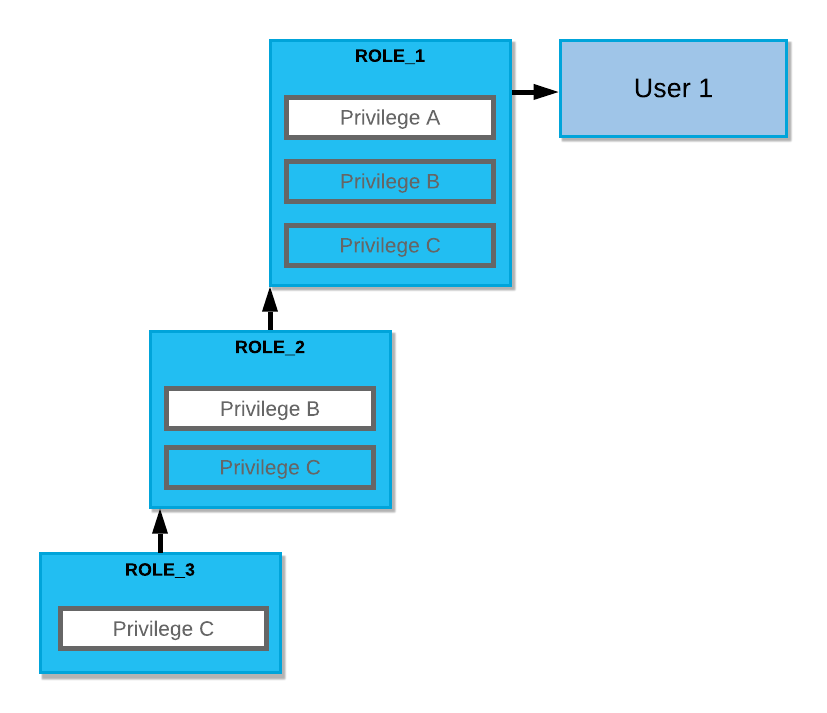
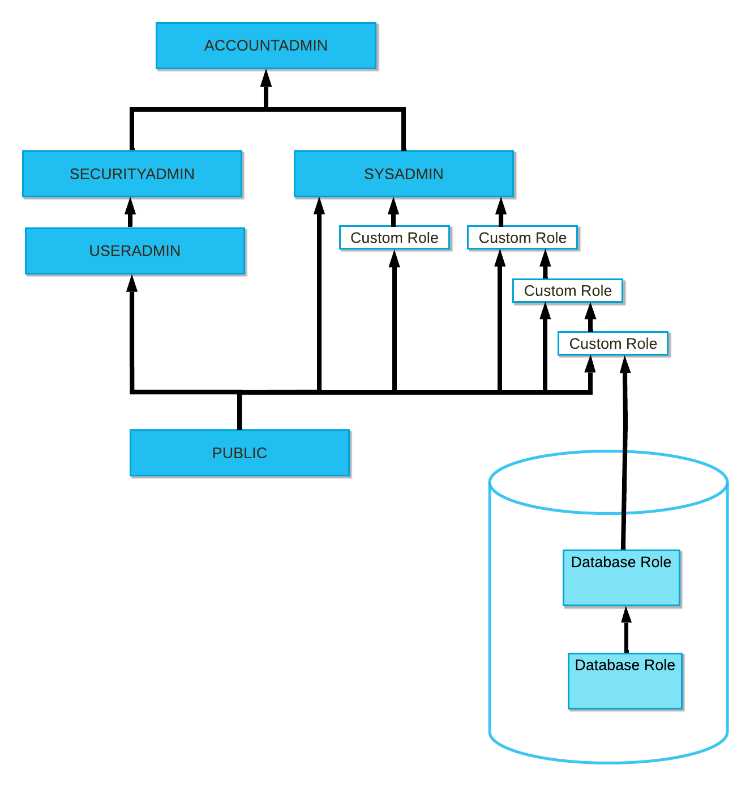

# Authorization #

Snowflake's authorization model is a combination of:
* RBAC: Role-Based Access Control model
  * Privileges are granted to Roles
  * Roles are granted to users
* DAC: Discretionary Access Control model
  * each object has an owner who can grant others access to the object

All Snowflake objects are individually securable. Access to objects operates on the principle of least privilege: unless allowed by a privilege, access is denied.

## Key Concepts ##
* User: A person or a program
* Role: An account-level object to which we can grant privileges
  * We can grant roles to users
  * Roles can be granted to other roles, creating a hierarchy
  * The privileges associated with a Role are inherited by any Roles above that Role in the hierarchy
  
  
* Privilege: A defined level of access to an object, e.g. `SELECT PRIVILEGE ON DATABASE db1`
  * Privileges that can be set depend on the securable object. They can be very broad or very granular.

## Default Roles ##


* `ORGADMIN`
  * Role that manages operations at the organization level. More specifically, this role:
    * Can create accounts in the organization.
    * Can view all accounts in the organization (using SHOW ORGANIZATION ACCOUNTS) as well as all regions enabled for the organization (using SHOW REGIONS).
    * Can view usage information across the organization.
* `ACCOUNTADMIN`: top level role
  * encapsulates the `SYSADMIN` and `SECURITYADMIN` roles
  * Access to account-level settings
  * Can manage Data Shares
  * Can manage Resource Monitors
  * Can manage Network Policies
* `SECURITYADMIN`: Manage Users, Roles and Network policies
  * Access to account-level settings with the exception of Usage & Billing
  * Can manage Network Policies
* `USERADMIN`: Manage Users and Roles
* `SYSADMIN`: Manage all Snowflake objects, except:
  * Data Shares
  * Resource Monitors
  * Network Policies
* `PUBLIC`: Lowest privilege role
  * Automatically granted to every User and Role in the Account

In addition to the default Roles, `USERADMIN` (or a user with the `CREATE ROLE` privilege) can create custom roles and assign roles to them. 
* As a rule of thumb, top-level custom roles should be assigned to `SYSADMIN` to ensure `SYSADMIN` has access to the objects the custom roles work with.
  * An exception to this rule of thumb is if the custom roles work with highly sensitive information.

### Role Commands ###
```
-- Create a new Role
CREATE ROLE <NEW_ROLE>;

-- Grant a Role to a parent Role
GRANT ROLE <CHILD_ROLE> TO ROLE <FATHER_ROLE>;

-- Create a user and assign them a Role
CREATE USER <NEW_USER>
    PASSWORD = <PASSWORD> 
    DEFAULT_ROLE = <ROLE>
    MUST_CHANGE_PASSWORD = TRUE
;
GRANT ROLE <ROLE> TO USER <NEW_USER>;

-- Review Privileges of a Role
SHOW GRANTS TO ROLE <ROLE>;

-- See to whom a Role is assigned
SHOW GRANTS OF ROLE <ROLE>;
```

## Other Access Control Mechanisms ##
* Secure Views and UDFs (User Defined Functions)
  * Prevent data from being indirectly exposed via programmatic methods
  * Only authorized users can see the view or UDF definition
  * bypass some of the optimizations to achieve better security so they are not as efficient
* Row-level access - uses `CURRENT_ROLE()` or `CURRENT_USER()` to provide row-level security, e.g.
  ```
  SELECT ...
  FROM data_table
  JOIN auth_table
    ON auth_table.auth = data_table.auth
    AND auth_table.role = CURRENT_ROLE()
  ;
  ```

