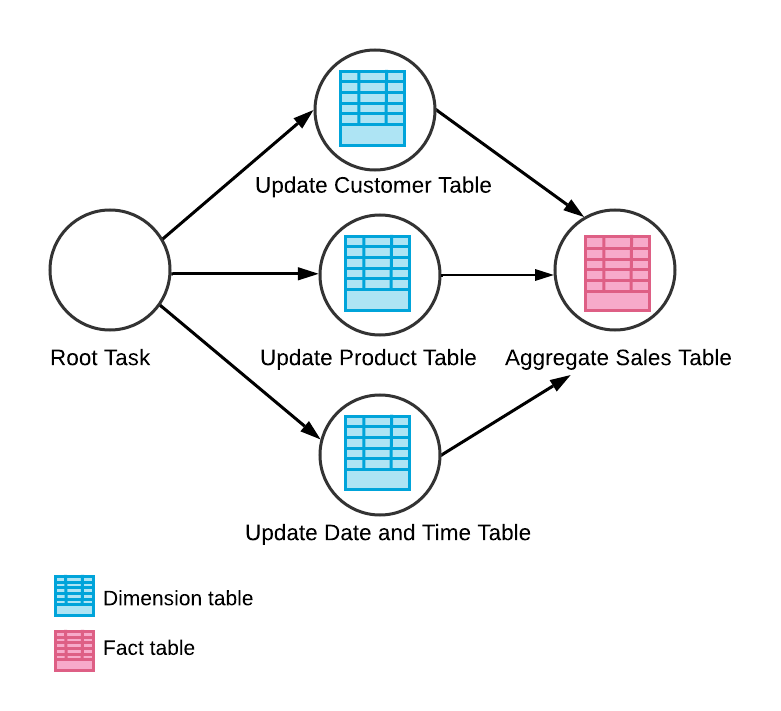

# Continuous Processing #

## Tasks ##
> [Tasks](https://docs.snowflake.com/en/user-guide/tasks-intro)

A Task is a way to run a **single SQL statement** on schedule without having to depend on external tools. A task can execute any one of the following types of SQL code:
* Single SQL statement
* Call to a stored procedure
* Procedural logic using [Snowflake Scripting](https://docs.snowflake.com/en/developer-guide/snowflake-scripting/index)

### Task Features ###
* Tasks can be queued based on the outcome of other Tasks to form DAGs
  * the Root task is the only one which can be scheduled
  * the root task can be queued in case the warehouse is currently busy with another workload
  * child tasks are always queued - they only run after the parent task finishes
  * each task can have a maximum of 100 children tasks
  * a tree of tasks can have a maximum of 1000 tasks, including the root one
  * each non-root task can have dependencies on multiple predecessor tasks, up to 100 predecessors
  * if a predecessor task is dropped, there are two options:
    * its child task becomes a standalone task
    * its child task becomes a root task
  ```
  -- Create a child task
  CREATE TASK <newTask> AFTER <rootTask>;
  ALTER TASK <newTask> ADD AFTER <rootTask>;
  ```
  
* Tasks can also be used with Streams
* Tasks can call Stored Procedures
* Tasks can be run at a set `SCHEDULE` interval (in minutes) or with a cron expression
* Creating a task requires the `CREATE TASK` privilege
* Tasks are initially created in the suspended state
  * they can be started/resumed with `ALTER TASK <task_name> RESUME;`
* Tasks execute with the privileges of the owning Role
  * if the owner role of a task is dropped, task ownership is reassigned to the role that dropped the owner role
* Tasks cannot be triggered manually
* Snowflake ensures only one instance of a task with a schedule is executed at a given time
  * if a task is still running when the next scheduled execution time occurs, that scheduled time is **SKIPPED**.
* Tasks have a maximum duration of 60 minutes by default

### Task Compute Resources ###
Tasks require compute resources to execute SQL code. When a task is being created, the user has the choice to opt for using their own Virtual Warehouse or let Snowflake use serverless compute:
* User-managed Virtual Warehouse. To enable that, the Virtual Warehouse where the task would execute must be specified with the `WAREHOUSE` option, see [Optional Parameters](https://docs.snowflake.com/en/sql-reference/sql/create-task#optional-parameters)
* Snowflake-managed (i.e. serverless compute model). This is useful for frequently running tasks which would make suspending the warehouse where they run impossible. While Snowflake will automatically scale the serverless compute depending on the workload, the initial size of the serverless compute resource can be specified using `USER_TASK_MANAGED_INITIAL_WAREHOUSE_SIZE`

### Task History ###
You can use the `information_schema.task_history()` Snowflake function to query the history of task usage within a specified date range. You need one of these privileges to see the task history:
* You have the `ACCOUNTADMIN` role
* You are the owner of a task
* You have the global `MONITOR_EXECUTION` privilege
```postgres-psql
SELECT *
FROM table(information_schema.task_history())
ORDER BY scheduled_time;
```

## Streams ##
Streams (also known as Table Streams) are Snowflake objects that store metadata about DML changes (`INSERT`, `UPDATE`, `DELETE`) made to tables, views and secure views. A Stream can be created on a table and used for CDC (Change Data Capture) to identify and act on changed records.

When created, a table stream logically takes an initial snapshot of every row in the source table by initializing a point in time (called an offset) as the current transactional version of the table. The stream then records the DML changes after this snapshot was taken.

* Streams hold no data. They can be thought of as timestamped bookmarks for a particular state of a table
* Streams can be of three types:
  * Standard Stream
    * Captures all changes in the table records
    * Supported on tables, directory tables, and views
  * Append-Only Stream
    * Tracks row inserts only
    * Supported on tables, directory tables, and views
  * Insert Only
    * Tracks row inserts only
    * Supported on EXTERNAL TABLES only
* Each stream contains the following metadata:
  * `METADATA$ACTION` - indicates the DML operation (`INSERT`, `DELETE`) recorded. Note that updates are recorded as `INSERT`, see `METADATA$ISUPDATE` below.
  * `METADATA$ISUPDATE` - indicates whether the operation was part of an `UPDATE` statement
  * `METADATA$ROW_ID` - unique and immutable ID for the row
* The `SYSTEM$STREAM_HAS_DATA` function indicates whether a stream contains change data capture (CDC) records
* Streams ensure exactly-once semantics for new or changed data in a table
  * a stream only contains the **last** DML action on a row. A stream will hold only one record per table row, if any, reflecting the current state of the row compared to its initial state when the stream was first created
  * if the row has not been modified, there will be no Stream record at all
  * if the row was modified but then it was reverted to its original state when the stream was first created, the Stream record for that row will be removed
* Multiple streams can be created for the same table and consumed by different tasks