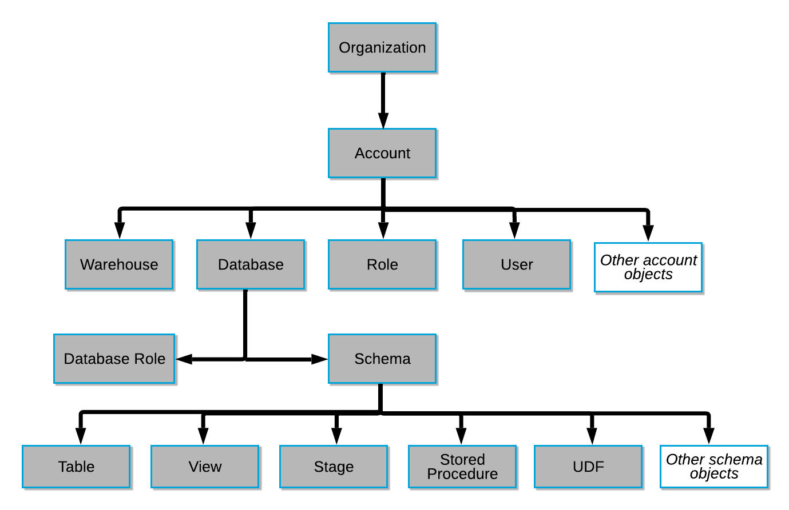

# Objects #
* All objects in Snowflake are securable - privileges on objects can be granted to Roles and Roles are granted to Users.
* Additionally, all objects can be interacted with and configured via SQL given the user has sufficient privileges.
* To own an object means that a role (NOT USER!) has the OWNERSHIP privilege on the object.
* Each securable object is owned by a single role, which by default is the role used to create the object.
* Other than the Organization and Account objects, objects can be at the Account level or the Schema level. Examples:
  * Account level objects:
    * Network Policy
    * User
    * Role
    * Grants
    * Warehouse
    * Database
    * Share
    * Resource Monitor
    * Storage Integration
  * Schema level objects:
    * Table
    * External Table
    * View
    * Stream
    * Task
    * Stored Procedure
    * UDF (User Defined Function)
    * Sequence
    * Stage
    * File Format
    * Pipe

> * Note that object identifiers are case insensitive and cannot contain spaces or special characters unless they are enclosed in quotes.
> * When an object identifier is enclosed in quotes, it becomes case sensitive. This should be avoided as it can contribute to hard to debug issues!



* Schemas and Database Roles are Database Level Objects
* The definitions of most objects can be retrieved using the [GET_DDL()](https://docs.snowflake.com/en/sql-reference/functions/get_ddl.html) function.

## Table ##
Tables hold all the data in a database. 

### Permanent ###
* Default table type, used for the highest level of data protection and recovery
* Persists until dropped
* 0–90 days of Time Travel depending on the Snowflake edition (0–1 days in Standard Edition, 0-90 days in Enterprise Edition and up)
* 7 days of Fail-Safe
* Can be cloned to a permanent, transient or temporary table
  * If you clone a Permanent table to Transient or Temporary, the old partitions will remain Permanent, but any new partitions added to the clone will be Transients/Temporary

### Transient ###
* Persists until dropped
* Available across sessions
* Time Travel: 0 or 1 days
* No Fail-Safe support
* Can only be cloned to a Temporary or Transient table

### Temporary ###
* Used for transitory data
* Tied to and available only within the context a single user session. As such, they are not visible to other users or sessions
* Time Travel: 0 or 1 days
  * A temporary table is purged once the session ends, so the actual retention period is for 24 hours or the remainder of the session, whichever is less
* Temporary tables incur storage costs
* No Fail-Safe support
* Can only be cloned to a temporary or transient table
* Can be created with a clustering key, if needed

### External ###
* Snowflake table "over" data stored in an external stage
* Persists until removed
* Read-only
* No Time Travel
* No Fail-Safe support
* Cloning is not supported
* XML files are not supported for external tables

## View ##
Named definition of a SQL query which can be queried as if it were a table. Views can be created on all table types, including external tables.

### Standard ###
* Default view type
* No data is stored
* No clustering support
* Executes as the role which owns it
* DDL available to any role with access to the view
* [Streams](https://docs.snowflake.com/en/user-guide/streams-intro.html) are supported

### Materialized ###
* Enterprise Edition is required for Materialized views
* Results of underlying query are stored
  * require storage space and active maintenance, which incur both storage and compute costs
  * while Materialized Views behave more like Tables, Time Travel is not supported
* Results are auto-refreshed in the background so new data loaded into the table will be propagated into the Materialized View
* Consumes background compute for the auto-refresh
  * The background compute does not require a customer-provided warehouse; Snowflake manages the compute
* Clustering is supported
* NO support for [Streams](https://docs.snowflake.com/en/user-guide/streams-intro.html)
* Changes to the schema of base table are not automatically propagated to materialized views
* Best used for:
  * Query results contain a small number of rows and/or columns relative to the underlying table
  * Queries that require significant processing, e.g. analysis of semi-structured data or expensive aggregates
  * The underlying table is an external one, which might be slower to query directly
  * The view’s base table does not change frequently

### Secure ###
Both Standard and Materialized views can also be defined as Secure
* Executes as the role which owns it
* DDL available only to authorized users
* Can be shared; secure views are mandatory when sharing
* Snowflake query optimizer bypasses optimizations used for regular views so secure views are less performant

## Stage ##
Stages in Snowflake specify where data files are stored (staged) in cloud storage. They facilitate data loading and unloading.
* When staging uncompressed files in a Snowflake stage, the files are automatically compressed using `GZIP` unless compression is explicitly disabled
* Snowflake automatically generates metadata for staged files:
* `METADATA$FILENAME`: stage path and name of the data file the current row belongs to
* `METADATA$FILE_ROW_NUMBER`: row number for each record in the staged data file
* `$[COLUMN_NUMBER]`: staged data file column number; e.g. `$1` refers to the first column in the staged file, `$2` refers to the second column, etc.

### Named Stages ###
* Created manually
* Referenced with `@[STAGE_NAME]`
* can specify file format
* Supported Cloud Storage services:
  * Amazon S3 Buckets
  * Google Cloud Storage Buckets
  * Microsoft Azure Containers
* Named Stages can be Internal or External
  * Internal Named Stage: cloud Storage location managed by Snowflake; data is stored internally within Snowflake.
  * Named External Stage: references data files stored outside Snowflake.
    * managed by the user or respective cloud provider and can even be in a different cloud provider than the Snowflake account
    * Creating an external stage requires providing
      * URL where the files are located
      * credentials to access the files
      * decryption keys to enable decryption of the data

### Internal Stages ###
* Can only be accessed using the SnowSQL CLI
* Can be of two types: User and Table Stage

#### User Stage ####
* Each user has a Snowflake personal stage allocated to them by default
* Referenced with `@~`
* Can only be accessed by the user it belongs to
* User stages do not support setting file format options. Instead, you must specify file format and copy options as part of the [COPY INTO <table>](https://docs.snowflake.com/en/sql-reference/sql/copy-into-table) command.

#### Table Stage ####
* Each table has a Snowflake stage allocated to it by default
* Referenced with `@%[TABLE_NAME]`
* Accessible to multiple users 
* Files can only be loaded/unloaded to/from the table the stage belongs to

## File Format ##
Pre-defined format structure that describes a set of staged data to access or load into Snowflake tables for CSV, JSON, AVRO, ORC, PARQUET, and XML input types
* A File Format can be created as a clone from another File Format

## Storage Integration ##
A Snowflake object that stores a generated identity and access management (IAM) entity for your external cloud storage, along with an optional set of allowed or blocked storage locations. This option enables users to create stages and load and unload data without supplying credentials.
* Account-level object
* A single storage integration can support multiple external stages

## Warehouse ##
Warehouses are the compute part of the Snowflake engine. They are a set of virtual machines provided at runtime to help execute a given query.

## Resource Monitor ##
See [Resource Monitors](../VirtualWarehouses/ResourceMonitors.md)

## Sequence ##
> [Using Sequences](https://docs.snowflake.com/en/user-guide/querying-sequences)

Sequences are schema-level objects used to generate unique numbers across sessions and statements, including concurrent statements. They can generate values for a primary key or any column that requires a unique value. They have an initial value and an interval.

You can access sequences in queries as expressions. The function `nextval`, will generate the next unique sequential value.
```postgres-psql
CREATE OR REPLACE SEQUENCE seq START = 1 INCREMENT = 5;
CREATE OR REPLACE TABLE PEOPLE 
(
  ID NUMBER DEFAULT seq.nextval, 
  NAME VARCHAR(50)
);
```

## Pipe ##
A special type of object which enables the automatic loading of data from Stage files as soon as they are available.
See [Snowpipe](../DataMovement/ContinuousDataLoading.md)

## Stored Procedure ##
> [Stored Procedure](https://docs.snowflake.com/en/sql-reference/stored-procedures.html)

Extend the system to perform operations.
* A stored procedure can return a single value or (if you are using Snowflake Scripting) tabular data
* Stored procedures can be written in:
  * Java (using Snowpark)
  * JavaScript
  * Python (using Snowpark)
  * Scala (using Snowpark)
  * [Snowflake Scripting](https://docs.snowflake.com/en/developer-guide/snowflake-scripting/index.html), an extension to Snowflake SQL that adds support for procedural logic
* Stored Procedures can be secure or unsecure
* Stored Procedures support schema definition (DDL) and data modification (DML) SQL statements
* Stored Procedures can run multiple SQL statements
* Stored Procedures are allowed, but not required, to explicitly return a value (such as an error indicator)
* Stored Procedures are called as independent statements
  ```postgres-psql
  CALL MyStoredProcedure_1(argument_1);
  ```
* The returned values CANNOT be used directly in a SQL statement
* Every `CREATE PROCEDURE` statement must include a `RETURNS` clause that defines a return type, even if the procedure does not explicitly return anything
* Store Procedures CANNOT return a set of rows
* Stored Procedures can be defined to run as their owner (by default) or as the procedure caller (`EXECUTE AS CALLER`)
* Stored Procedures interact with Snowflake using an API in the respective language. Here are some JavaScript API Objects:
  * `Snowflake` - contains the methods of the Stored Procedure API; this object is accessible by default (there is no need to create it)
  * `Statement` - provides method to execute a query statement and access its metadata
  * `ResultSet` - iterable object which contains the query results;
  * `SfDate` - wrapper around the Snowflake SQL `TIMESTAMP` data types
* Snowflake Scripting allow migrating of other databases' stored procedures by embedding their SQL in the Snowflake Stored Procedure's code
* Argument names in the SQL portions of a Stored Procedure are case-insensitive

## UDF: User-Defined Function ##
> [User Defined Function](https://docs.snowflake.com/en/sql-reference/user-defined-functions.html)

UDFs extend Snowflake to perform operations that are not available through built-in, system-defined functions.
* UDFs accept 0 or more parameters.
* For each row passed to a UDF, the UDF must return either:
  * a scalar (i.e. single) value, or
  * if defined as a `RETURNS TABLE` function, a set of zero or more rows.
    * When the UDF returns a table, it can be called a User Defined Table Function (UDTF)
* A UDF can be written in:
  * SQL (default)
  * Java
  * JavaScript
  * Python
* UDFs can be secure or unsecure
* UDFs do not support schema definitions (DDL) or data modifications (DML)
* The returned value(s) CAN be used directly in statement SQL
* While system functions can be listed with `SHOW FUNCTIONS;`, to list UDFs, use `SHOW USER FUNCTIONS;`
* When calling a UDF which returns a table, you must wrap it in the `TABLE()` function
  ```postgres-psql
  SELECT * FROM TABLE(MY_UDTF_FUNCTION(param1, param2));
  ```

## Data Shares ##
See [Data Sharing](DataSharing.md)
