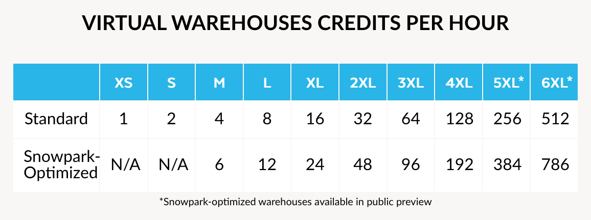
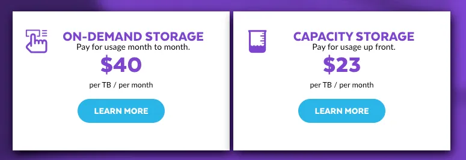

# Pricing #

Snowflake pricing and cost are based on the actual usage. You pay for what you use and scale storage and compute independently.

## Storage Costs ##
All customers are charged a flat monthly fee per Terabyte for the data they store in Snowflake. Storage cost is measured using the **average daily amount of storage used per month, after compression**, for all customer data stored in Snowflake.

The storage includes:
* Data stored in tables, even temporary ones
* Historical data for Time Travel 
* Historical data for Fail-Safe 
* Internal Stages

## Compute Costs ##
Customers pay for virtual warehouses using Snowflake credits. The cost of these credits depends on the Snowflake edition that you are using, and the cloud region of the Snowflake account, see https://www.snowflake.com/pricing/. For example, the costs per credit for an account in US East (North Virginia) on AWS were:
* Standard Edition: $2.00 per credit
* Enterprise Edition: $3.00 per credit
* Business Critical Edition: $4.00 per credit

Apart from the Snowflake edition, the number of credits that a data warehouse consumes is determined by the following:
* The warehouse size
* The number of clusters (for multi-cluster warehouses)
* The time each server in each cluster runs. Server runtime is billed by seconds with a one-minute minimum

## Cloud Services Costs ##
Customers pay for cloud services using Snowflake credits. The typical utilization of cloud services (up to 10% of daily compute credits) is included for free, meaning most customers will not see incremental charges for cloud service usage.

## Data Transfer Costs ##
Customers who wish to move or copy their data between regions or cloud providers will incur data transfer charges. Features such as External Tables, External Functions, and Data Lake Export may incur data transfer charges.

## Purchasing the Snowflake Service ## 
* On-Demand: Customers are charged a fixed rate for the consumed services and billed in monthly arrears
* Pre-paid: Pre-purchase Capacity, which involves a commitment to Snowflake. The Capacity purchased is then consumed monthly, providing lower prices and a long-term price guarantee, among other advantages.

