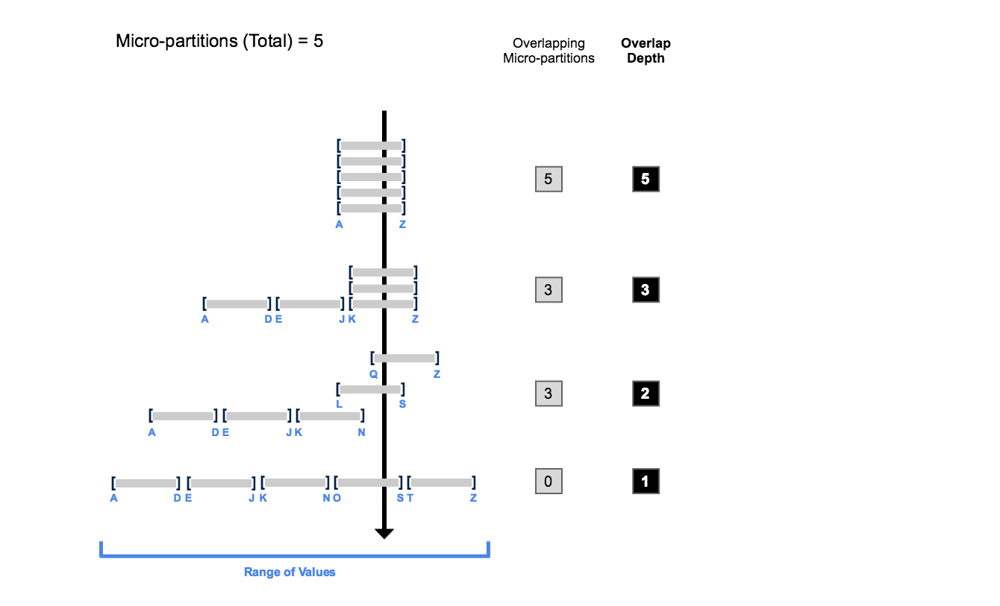

# Data Clustering #

## Clustering ##
Typically, data stored in tables is sorted along natural dimensions, for example, by date. This process is called clustering.  Data that is not sorted/clustered may hurt query performance, particularly on huge tables.

The Cloud Services Layer collects clustering metadata for the micro-partitions in a table:
* The number of micro-partitions that comprise the table.
* The number of micro-partitions containing values that overlap with each other.
* The depth of the overlapping micro-partitions.

## Natural Clustering ##
As data is loaded into a table, micro-partitions are created based on ingestion order. That is natural clustering.
  * Natural clustering occurs when data is read as a single data load
  * The ingestion order may be highly correlated with the values in one or more columns, e.g. autoincrement IDs, dates, sequential numbers, etc.
  * The source data organization determines what range of values (`MIN/MAX`) is represented in each micro-partition

## Clustering Depth ##
Clustering depth measures the average number of overlapping micro-partitions for a specific column value.



* The smaller the cluster depth is, the better clustered the table is.
* A table without partitions would have a cluster depth of 0.
* You can use the following commands to get the Cluster Depth:
  * [SYSTEM$CLUSTERING_DEPTH](https://docs.snowflake.com/en/sql-reference/functions/system_clustering_depth.html)
  * [SYSTEM$CLUSTERING_INFORMATION](https://docs.snowflake.com/en/sql-reference/functions/system_clustering_information.html)

## Automatic Clustering ##
> [Automatic Clustering](https://docs.snowflake.com/en/user-guide/tables-auto-reclustering.html)

Snowflake provides periodic & automatic re-clustering to maintain optimal clustering. When the ingestion-order natural clustering is not advantageous or has degraded due to extensive `INSERT` operations, Snowflake provides a mechanism for its customers to override its natural clustering algorithms by defining clustering keys. This will result in like data (by key) being co-loaded in the same micro-partitions.

Snowflake only reclusters a clustered table if it will benefit from the operation. It monitors and evaluates the tables to determine whether they would benefit from reclustering, and automatically reclusters them, as needed. In most cases, no tasks are required to enable Automatic Clustering for a table.

Automatic clustering can be suspended and resumed:
  ```
  ALTER TABLE t1 [SUSPEND|RESUME] RECLUSTER;
  ```

## Clustering Keys ##
```
CREATE|ALTER TABLE ...
CLUSTER BY (<column_or_expression>, ...)
```
* Use one to three clustering keys at maximum
* Prefer and order clustering keys from low to high cardinality which will result in fewer, larger sets of micro-partitions being co-located together
* It is important to choose a clustering key that has appropriate cardinality:
  * A large enough number of distinct values to enable effective pruning on the table.
  * A small enough number of distinct values to allow Snowflake to effectively group rows in the same micro-partitions.
* Expressions such as `DATE()` or `TRUNC()` can be used for the clustering keys on columns with high cardinality, e.g. `TIMESTAMP` or hash strings, etc.
* Snowflake maintains and updates the clustering order in the background which incurs compute and storage costs as micropartitions need to be rewritten
* Typically, clustering keys are added after ingestion, and/or when natural clustering has degraded.
* Cluster Keys are placed on columns usually used in `WHERE`, `JOIN` and `ORDER BY` clauses

### Clustering Keys Considerations ###
* Clustering keys are most useful with tables which
  * are very large (multi-terabyte range)
  * have degraded in query performance as the table grows
  * have large clustering depth values
* Frequently-changing tables will consume more credits for reclustering
* The `SYSTEM$CLUSTERING_INFORMATION()` function can be used to get clustering information on a table's column. Good clustering will have:
  * low `average_depth` values which indicates low micro-partition `MIN/MAX` values overlap
  * `partition_depth_histogram` with a high number of low value depths
* You can cluster materialized views, as well as tables
* Snowflake recommends a maximum of 3 or 4 columns (or expressions) per key.
