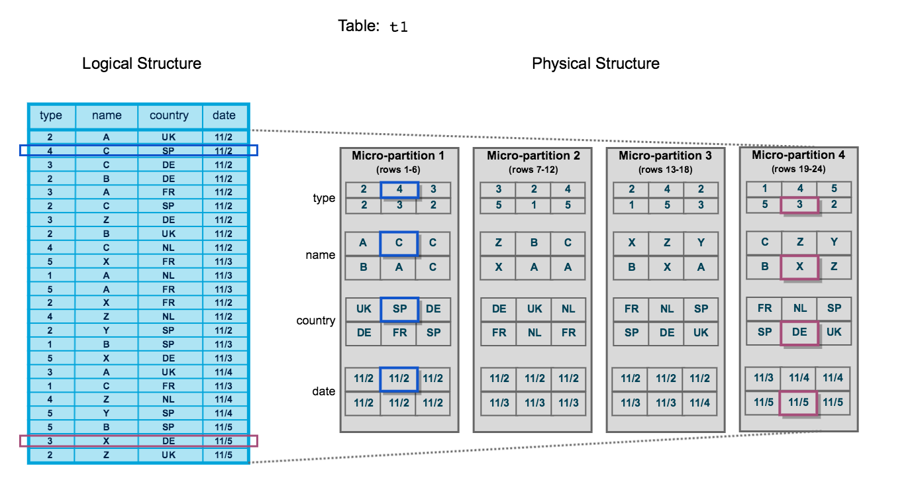

# Data Storage Layer #

The Data Storage Layer is Snowflake managed cloud-based storage available in the major cloud providers (AWS, Azure and GCP).
* Full native support for semi-structured data: JSON, AVRO, ORC, XML and Parquet
* Customers are billed for data based on its compressed size as well as any files existing in internal (Snowflake-managed) stages

## Micro-Partitions ##
All data in Snowflake tables is automatically divided into micro-partitions. Micro-Partitions are contiguous units of storage that generally hold a maximum of 16MB or encrypted, compressed data (uncompressed the data is between 50-500MB), organized in a columnar way.

* Micro-partitions are IMMUTABLE and versioned
  * In order to modify data in a micro-partition, a new version of the micro-partition must be created. The older micro-partition is then marked for deletion
  * This is what enables the time travel feature in Snowflake
* Data is compressed within each micro-partition
  * Within each partition, data is organized in a hybrid columnar format
  * On load, data is automatically analyzed for the optimal compression scheme based on its format
  * Organizing data based on columns containing data of the same type allows for efficient compression which reduces storage and I/O
* Snowflake attempts to preserve natural data co-location
  * Since data is organized in micro-partitions on load, some natural data clustering and optimization occurs
* Table records are contained entirely within a micro-partition, they cannot span multiple partitions

### Query Pruning ###
The metadata stored in the Cloud Services Layer allows Snowflake to minimize the data it needs to load from the storage layer in order to resolve a query. Snowflake performs two types of pruning:
* micro-partition pruning - reading only the micro-partition files needed to resolve a query
* column pruning - only reading the columns that we need from each micro-partition

The Cloud Services Layer metadata also allows the processing of certain queries (e.g, MIN, MAX) at the Cloud Services Layer without engaging the compute or storage layers. The metadata tracked is:

* At the table level:
  * row count
  * table size (in bytes)
  * micro-partition references and table versions
* At the Micro-Partition level:
  * MIN/MAX (range of values) in each column
    * this allows micro-partition pruning during query optimization
  * number of distinct values
  * NULL count

## Data Storage Billing ##
* Customers are billed for actual (compressed) storage used based on the daily average, billed per Terabyte per month
  * On-demand Pricing: Billed in arrears at $40 per Terabyte per month with a minimum charge of $25
  * Pre-purchased Capacity:
    * Billed upfront for committed storage capacity
    * Price varies depending on cloud platform
    * Customer is notified when they have consumed 70% of pre-purchased capacity
