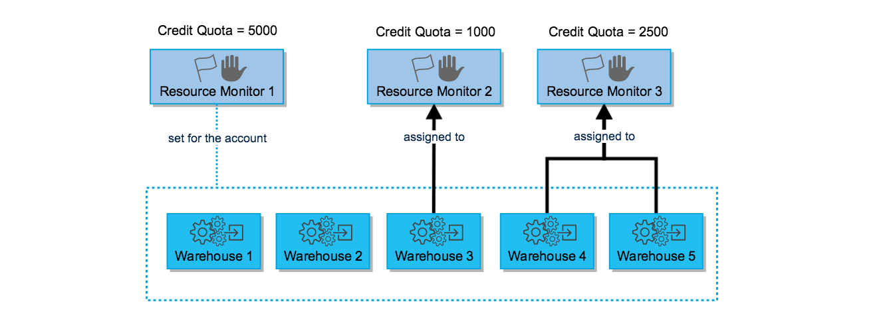

# Resource Monitor #
> [Resource Monitor](https://docs.snowflake.com/en/user-guide/resource-monitors.html)

To help control costs and avoid unexpected credit usage caused by running warehouses, Snowflake provides resource monitors. A resource monitor can be used to monitor credit usage by virtual warehouses and the cloud services needed to support those warehouses.
* Limits can be set for a specified interval or date range. When these limits are reached and/or are approaching, the resource monitor can trigger various actions, such as sending alert notifications and/or suspending user-managed warehouses.
* Resource Monitors can only be created by account administrators (i.e. users with the ACCOUNTADMIN role)
* Account administrators can choose to grant users with other roles the `MONITOR & MODIFY` grants to view and modify Resource Monitors
* Resource Monitors can be set at two different Monitor Levels:
  * Account Level: a single Monitor can be set to control credit usage for all warehouses in your account.
  * Warehouse Level: a monitor can be assigned to one or more warehouses, controlling the credit usage for each warehouse
  * NOTE: A warehouse can only be assigned to a single Resource Monitor below the account level
* The used credits for a resource monitor reflects the sum of credits consumed by all assigned warehouses within the specified interval, along with the cloud services used to support those warehouses during the same interval.

* Resource Monitors can be replicated when replicating Databases

## Configuring Resource Monitors ##
We need to specify several parameters when creating a Resource Monitor:
* Credit Quota: specifies the number of Snowflake credits allocated to the monitor for the specified frequency interval.
  * Any number can be specified
  * Snowflake tracks the used credits/quota within the specified frequency interval by all warehouses assigned to the monitor
  * At the specified interval, this number resets back to 0
* Monitor Level: specifies whether the resource monitor is used to monitor the credit usage for your entire Account (i.e. all warehouses in the account) or a specific set of individual warehouses.
* Schedule: Consists of several properties
  * Start: Date and time (i.e. timestamp) when the resource monitor starts monitoring the assigned warehouses. Supported values:
    * Immediately (i.e. current timestamp)
    * Later (i.e. any future timestamp)
    * Note, however, that regardless of the time specified in the start date and time, resource monitors reset at 12:00 AM UTC.
  * Frequency: The interval at which the used credits reset relative to the specified start date. Supported values:
    * Daily
    * Weekly
    * Monthly
    * Yearly
    * Never (used credits never reset; assigned warehouses continue using credits until the credit quota is reached)
  * End: Date and time (i.e. timestamp) when Snowflake suspends the warehouses associated with the resource monitor, regardless of whether the used credits reached any of the thresholds defined for the resource monitor 
  * Actions/Triggers: the action to perform if a given threshold is reached within the specified interval
    * Thresholds are usually expressed as a percentage of the credit quota
    * Notification are sent to all account administrators who have enabled receipt of notifications and non-administrator users in the notification list
    * Resource monitors support the following actions:
      * Notify & Suspend: send a notification and suspend all assigned warehouses after all queries in flight have completed.
      * Notify & Suspend Immediately: send a notification and suspend all assigned warehouses immediately, which cancels any queries in flight.
      * Notify: Perform no action, but send an alert notification

```
USE ROLE accountadmin;

CREATE OR REPLACE RESOURCE MONITOR limit1 WITH CREDIT_QUOT=2000
    FREQUNCY = WEEKLY
    START_TIMESTAMP = '2019-03-04 00:00 PST'
    TRIGGERS ON 80 PERCENT DO SUSPEND
             ON 100  PERCENT DO SUSPEND_IMMEDIATE;

ALTER WAREHOUSE wh1 SET RESOURCE_MONITOR = limit1;
ALTER WAREHOUSE wh2 SET RESOURCE_MONITOR = limit1;
```

## Warehouse Suspension and Resumption ##
If a Resource Monitor suspends a Warehouse, it cannot be restarted unless one of these conditions are met:
* The next interval, if any, starts, as dictated by the start date for the monitor. 
* The credit quota for the monitor is increased. 
* The credit threshold for the suspend action is increased. 
* The warehouses are no longer assigned to the monitor. 
* The monitor is dropped.